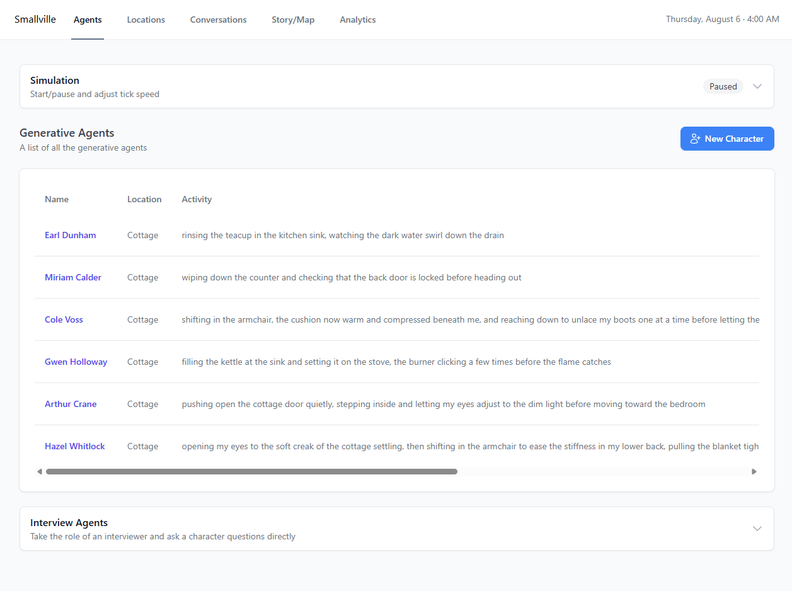
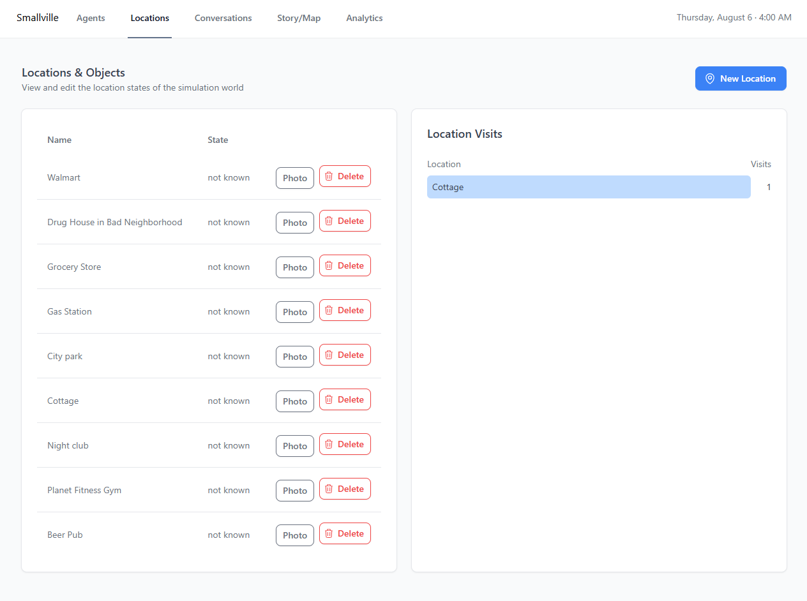
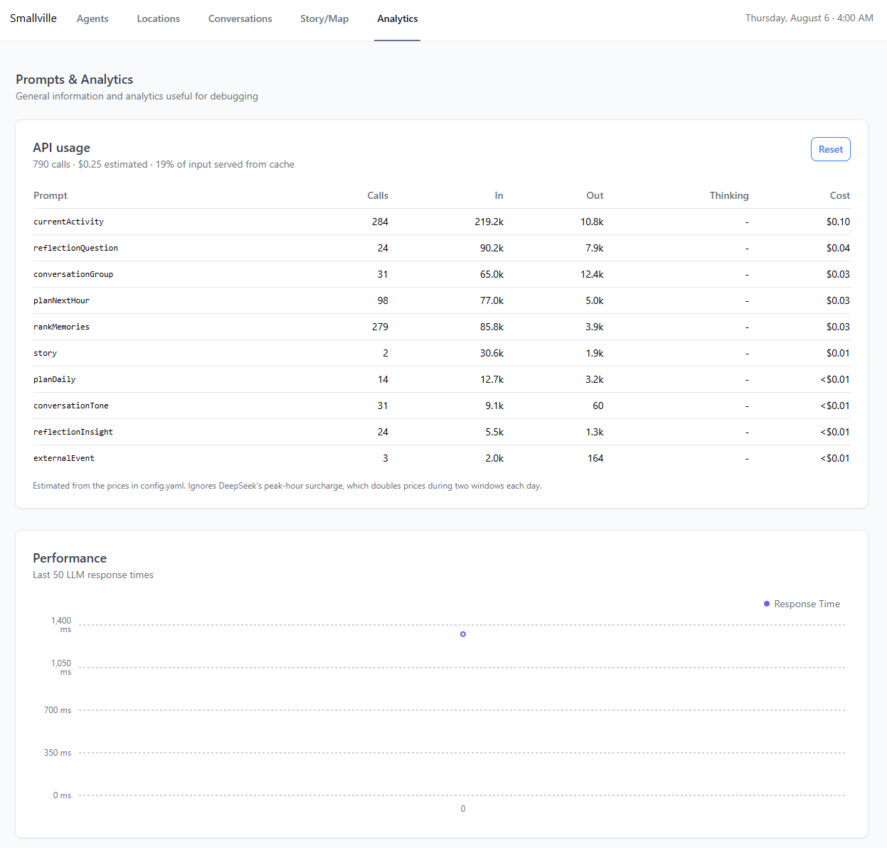

# Smallville [](LICENSE) [](https://github.com/nickm980/smallville) [](https://www.deepseek.com/)

## Generative agents for video games

Generative agents are virtual characters that store memories and dynamically react to their environment. Using an LLM, agents observe their surroundings, form and recall memories, make plans, and react to changes in the world around them — instead of following hand-written dialogue trees and schedules.

This project has three layers of history worth knowing. It started as the Stanford/Google paper [_Generative Agents: Interactive Simulacra of Human Behavior_](https://arxiv.org/pdf/2304.03442.pdf) (2023) — agents with a memory stream, planning, and reflection, scored on recency, importance, and relevance. [nickm980/smallville](https://github.com/nickm980/smallville) is a faithful Java implementation of that architecture, built as a library other games could drive over HTTP. This fork retargeted it at DeepSeek and grew a full Next.js dashboard around it — a town map, per-agent diaries, a conversation feed, location images, and a generated "Story So Far" — so you can actually watch and steer a town of agents instead of only driving them through the API. Then a sustained pass went back through the inherited engine and found that several of its load-bearing pieces didn't actually work — not visible from reading the code, only from watching agents — and repaired the simulation's underlying model of what an agent knows, wants, and has actually experienced. See [How agents think](#how-agents-think).

## Screenshots

| Agents | Town map |
| --- | --- |
|  |  |

| Conversations | Locations & objects |
| --- | --- |
|  |  |

| Analytics |
| --- |
|  |

## What's different in this fork

**Runs on DeepSeek, not OpenAI**, with reasoning ("thinking") disabled by default — the configured model is a reasoning model, and almost nothing here benefits from the deliberation, which bills as output tokens. Turning it off was the single largest responsiveness improvement of the whole project. The server talks to any OpenAI-compatible chat completions endpoint, so swapping providers is a config change; see [Configuration](#configuration).

**A real dashboard**, built with Next.js, replacing the old static/embedded UI:
- Create, edit, and delete agents and locations, including nested sub-locations (e.g. `Cottage: Kitchen`)
- **AI-generated personalities**, built from six required traits and an alignment dial (see [Character creation](#character-creation))
- **A town map** — a visual layout of every location, with a photo and who's currently there, instead of only reading names off a list
- **Play/pause and speed controls** for the simulation loop (see [Ticks, intervals, and the timestep](#ticks-intervals-and-the-timestep))
- **Per-agent diaries** — a chronological view of everything an agent has observed, planned, and reflected on
- **A global conversation feed** — grouped by conversation, with more than two participants when the room calls for it
- **Location images** — attach a photo to any location and see it on the map
- **A generated "Story So Far"** narrative (see [The story feature](#the-story-feature))
- **An analytics panel** — token usage and estimated cost, broken down per prompt, with cache hit rate (see [Cost visibility](#cost-visibility))
- A live simulated clock (real weekday/date, not just a time-of-day) visible from every page

**Conversations are relationship-driven and knowledge-gated, not a timer.** In the original engine, two agents only talk if you script it; a fixed cooldown was added early in this fork's life and later replaced. Now, who talks to whom follows an actual relationship model, and what they can say is bounded by what they've actually witnessed about each other — see [Relationships](#relationships) and [How agents think](#how-agents-think).

## How agents think

Early on, the simulation had no way to tell apart what an agent *intends*, what actually *happened*, and what they were merely *told*. All three were strings in the same memory stream, in the same voice, fed back into prompts interchangeably. Nearly every strange thing agents did traced back to that one gap:

- A plan to *"join in the conversation and share a joke"* became a first-hand memory of a conversation that never happened — intent laundered into event.
- Each agent's own activity text was broadcast to every other agent and treated as ground truth, so one agent's invention became everybody's fact.
- Conversation prompts handed out every participant's full characteristics, so agents knew each other's secrets on sight — and when told something a character shouldn't know, the model invented a shared past to justify it.

The fix was the same move each time: record where a piece of information actually came from. A bare `"No, what happened?"` in a memory stream became `"Maria said: No, what happened?"`. Whether two agents are co-located now comes from the world's own state, not a model's prose. Conversations carry only what each pair has actually witnessed or been told about each other.

Worth being explicit about: earlier attempts at this — prompt instructions like *"do not invent conversations that didn't happen"* — were treating a symptom. The diary those prompts read from was already full of invented conversations; no instruction at the last stage fixes corruption that entered several steps earlier.

Nobody starts knowing anybody, and there's no way to look a secret up. In one run, two agents independently noticed a third doing perimeter sweeps and started theorizing about him — one citing evidence he'd actually witnessed — without either of them being told his actual secret. That's the kind of behavior this architecture exists to produce, and it wasn't happening before this pass.

This guarantee is enforced at the prompt level, not a structural one — the model still writes every character's dialogue in one call and technically has access to each speaker's full description while doing it. A structural fix would generate dialogue turn-by-turn from each speaker's own point of view, at roughly ten times the LLM calls; not done here. See [Known limitations](#known-limitations).

## Relationships

Conversation triggering used to be a plain clock — any two co-located agents talked every 60 simulated minutes, forever. In a town where people share a handful of locations, that's a metronome, not a social model.

There's now a relationship graph tracking, per pair of agents, how often they've spoken, how warmly, and when. After each conversation, one small model call judges its tone (warm, neutral, or tense). Whether two co-located agents strike up a conversation depends on how much they'd actually want to: strangers almost always introduce themselves, and beyond that, likelihood rises with novelty (how long it's been) and affinity (how warmly their past conversations have gone). Sleeping agents don't talk.

Pass `--seed <n>` on startup to replay a run with the same random decisions.

## Concerns

Roughly twice a simulated day, something happens to somebody that they didn't choose and the simulation didn't otherwise generate: a parent calls, a letter arrives, a card declines. Nothing about it is simulated — a fact just lands, tagged with a source (family / friend / institution / chance), a valence, a demand on the agent's attention, and a privacy level.

Privacy is the interesting part: a concern somebody would rather keep quiet puts them in direct conflict with the same system that spreads what agents know about each other (see [How agents think](#how-agents-think)) — now there's something to actually keep or leak, not just gossip circulating for its own sake.

Concerns expire rather than resolve. That's deliberate — there's no economy or consequence model here, and building one wasn't the point of this pass (see [Known limitations](#known-limitations)). Tune frequency and tone with `eventsPerSimulatedDay` and the three `*EventWeight` keys in `config.yaml`.

## Character creation

Generating a character — one click in the dashboard, or `POST /agents/generate` — asks the model for six required things: a daily anchor, a want, something they visibly do, a flaw, someone off-screen in their life, and a tell. All six are required; the generator won't return a character missing one.

An `alignment` value from 0–100 (`?alignment=` on the endpoint, a dial in the dashboard) shifts what the generated character wants and who ends up paying for it — low values skew toward characters whose wants come at other people's expense, high values the opposite. Defaults to 50.

## Plans

Plans changed from schedules into something closer to intentions. A daily plan is 4–6 goals, each with a time of day and a location, not a timestamped itinerary; an hourly plan is one or two intentions, not several. Both are written to refuse outcomes, reactions, and joint action — a plan can say an agent means to be somewhere, not that they will laugh at a joke once they get there. What actually happens is decided later, in the moment.

Plans expire instead of lasting forever: short-term plans last a simulated hour, daily goals expire at the date rollover, and staleness is judged from when a plan was *written*, not the time it names (a plan written at 11:45pm for 12:15am names a time that's nearly a full day old by evening). Daily goals are marked addressed once the agent actually visits their location.

## The story feature

The dashboard can generate a running narrative ("Story So Far") summarizing what's happened in the simulation, via `GET /story` and `POST /story/generate`.

The story is stored as a list of passages plus a rolling summary, rather than one ever-growing string. Every passage is kept, and the dashboard still renders the full narrative — but the *prompt* sent to the model only includes the six most recent passages verbatim plus a summary of everything before that, so generating the next passage doesn't get more expensive, or eventually stop fitting in context, the longer the story gets.

## Persistence

World state survives a restart. `world-data/world.json` holds agents, full memory streams, locations, conversations, relationships, concerns, and the simulated clock. It autosaves every 2 minutes and on shutdown, and loads automatically at startup. A clean shutdown runs the save; a force-kill can lose up to two minutes.

Restoring is deliberately forgiving: an agent whose location no longer exists is placed elsewhere rather than dropped, unknown/older memory types are skipped rather than failing the whole load, and writes are atomic so a crash mid-save can't corrupt the file.

Story data (`story-data/`) and uploaded location images (`location-images/`) already persisted across restarts independently of this.

## Cost visibility

The configured model is a reasoning model, and reasoning tokens bill as output — a six-line daily plan was once observed carrying several hundred tokens of deliberation nobody asked for. `thinking` is disabled by default now (see [Configuration](#configuration)). Every LLM call site is labelled, and token usage is aggregated per prompt and exposed at `GET /usage` (reset with `POST /usage/reset`), alongside a cost estimate and the cache hit rate.

Classification-style calls — ranking memories, choosing an activity, judging conversation tone — can be routed to a separate, cheaper `cheapModel` instead of the main model.

## Ticks, intervals, and the timestep

Two things control pacing, but only one is really meant to be tuned:

- **Interval** — how many real-world seconds pass between ticks. Controlled from the dashboard's Simulation panel; this is the dial to turn for a "start it, walk away, come back later" run.
- **Timestep** — how many simulated minutes each tick advances the clock. Fixed at 20 minutes by design. Several parts of the simulation (conversation cooldowns, plan freshness) are tuned around that number, and world persistence deliberately does not restore a saved timestep for the same reason — a `POST /timestep` endpoint still exists for experimentation, but changing it is unsupported territory.

## Bug fixes

A sample of what got found and fixed along the way, grouped by theme. Several more are described in context above rather than repeated here — see [How agents think](#how-agents-think) and [Plans](#plans) in particular.

*Memory and retrieval*
- Memory retrieval was effectively relevance-only: candidates were collected into a map keyed by score (so identical scores destroyed each other), the recency formula produced `NaN`/infinite values that tripped a fallback discarding everything but relevance, importance swamped both other components, and relevance could go unboundedly negative. Retrieval is now a proper weighted, bounded (0–1 each) blend of recency, importance, and relevance — see the retrieval keys in [Configuration](#configuration).
- `Memory`'s constructor stripped every hyphen from every memory ever formed, so agents remembered being "wellknown" and working the "3:004:00" shift.
- Reflection was firing on the majority of agent updates against a design intent of a handful per day — the cutoff had been calibrated against the broken recency formula above and never adjusted once it was fixed.

*Persistence and world state*
- The server kept all world state in memory only — restarting lost every agent, location, and memory stream. See [Persistence](#persistence).
- The dashboard and backend ticked from different threads over plain, unsynchronized collections. World mutations are now locked per-agent so a reset doesn't block for the minutes a full tick can take; reads stay unlocked over concurrent collections.
- Plan times were stamped with the wall-clock date while everything else runs on the simulated clock, which can cross midnight within minutes of real time.
- `getConversationsAfter` ignored its argument and returned the entire history regardless of the requested cutoff.
- Adding an agent or editing a personality used to wait out an in-flight tick — 30-45 seconds — for work that's a map insert. Those control paths no longer take the simulation lock.

*Conversations*
- Asked for `Name: line` dialogue, the model would sometimes write a narrative scene instead, which parsed to zero lines and got the whole conversation discarded as empty. Conversation prompts now use JSON mode, are told the actual location (a Walmart had once been rendered as a church basement), and an empty result retries once before being skipped instead of thrown away.
- `Mustache` HTML-escaped every substituted value, so apostrophes in agent-generated text arrived in prompts and output as `&#39;`.

*Correctness / crashes*
- Chat requests were encoded with the platform's default charset instead of UTF-8, corrupting non-ASCII output.
- A crash when the model returned a compound location name (e.g. `"Cottage: Kitchen"`) that didn't exactly match a location.
- A null-pointer crash when the model omitted an activity, plus per-agent fault isolation so one bad LLM response no longer kills the tick for every other agent.
- Several API endpoints silently failed because the routing library needs a compiler flag to resolve `@Param`-annotated arguments, which isn't set — fixed by reading path params directly.
- Agents could end up "talking to themselves" when an observation string happened to contain their own name.
- A reaction-triggering loop scaled O(n²) with agent count and could stall ticking for minutes with more than a handful of agents in one place.
- Memory/diary entries were sorted by their already-formatted `"h:mm a"` time string instead of the underlying timestamp, breaking ordering across the AM/PM boundary.
- `getTokenEmbeddings` POSTed to OpenAI's endpoint using the DeepSeek key. Deleted.
- Pausing the simulation interrupted the in-flight request, and the retry loop treated the cancellation itself as a failure, burning the entire retry budget on a pause.

**How these were found:** almost entirely by reading agent diaries and comparing them against what the simulation had actually recorded — `/conversations`, `/agents/{name}/diary` — rather than by reading the code. Four agents whose diaries described a conversation that had silently failed to parse; three agents recording the exact same activity text word for word because they'd been handed each other's; an agent unlacing the same shoes for two simulated hours because the activity prompt only ever knew one step of its own history. None of it throws an exception. If you're extending this, the method is: run it, read a day of diaries, and check every remembered interaction against the actual record.

## Getting started

**Prerequisites:** Java 17, [Maven](https://maven.apache.org/), and Node 18+.

### 1. Get a DeepSeek API key
1. Sign up / log in at [platform.deepseek.com](https://platform.deepseek.com/)
2. Go to **API Keys** in the left sidebar and click **Create new API key**
3. Copy the key (starts with `sk-...`) — you won't be able to view it again after closing the dialog

Using a different OpenAI-compatible provider (OpenAI, a local model server, etc.) instead? Grab a key/endpoint from them and see [Configuration](#configuration).

### 2. Build and run the server
The key is only ever passed in as a command-line argument below — it isn't read from an environment variable or written to any config file, so there's nothing to leak if you share your clone of this repo.
```
cd smallville
mvn -DskipTests package
java -jar target/smallville-1.3.0.jar --api-key sk-your-key-here --port 8080
```
The server starts on port 8080 (override with `--port`). Add `--seed <n>` to replay a previous run's random decisions. World state, if any exists in `world-data/`, loads automatically on startup and autosaves from then on.

### 3. Run the dashboard
```
cd dashboard
npm install
npm run dev
```
Open http://localhost:3000. By default the dashboard talks to the server on `localhost:8080` — no extra configuration needed. To point it at a server running elsewhere, copy `dashboard/.env.local.example` to `dashboard/.env.local` and set `NEXT_PUBLIC_API_URL`.

### 4. Create your town
Use the dashboard to add locations and agents (or generate a personality with one click), then hit Start in the Simulation panel.

## Configuration

`smallville/src/main/resources/config.yaml` controls the LLM backend and simulation tuning; every key is commented in the file itself. A `config.yaml` placed in the working directory you run the jar from overrides the copy baked into the jar — this is how tuning changes between runs without rebuilding, and that working-directory file is gitignored.

```yaml
apiPath: https://api.deepseek.com/chat/completions
model: deepseek-v4-pro
cheapModel: deepseek-v4-flash   # classification-style calls; blank sends everything to `model`
thinking: disabled              # reasoning tokens bill as output; see Cost visibility
```
Point `apiPath` and `model` at any other OpenAI-compatible chat completions endpoint (OpenAI itself, a local model server, etc.) to use a different provider.

Also configurable:
- Three `*PricePerMillion` keys used to estimate cost on `/usage`.
- Memory retrieval tuning: `recencyHalfLifeHours`, `retrievalCount`, and `recencyWeight` / `importanceWeight` / `relevanceWeight` (see [Bug fixes](#bug-fixes)).
- `reflectionCutoff` — how much weight must build up since an agent last reflected before they do again.
- The [Concerns](#concerns) system: `eventsPerSimulatedDay` and `badEventWeight` / `ambiguousEventWeight` / `goodEventWeight`.

`prompts.yaml` in the same directory controls the prompt templates sent for each part of the agent update pipeline.

## Known limitations

Be honest about these — the work above is real, but none of it is finished.

- **Memory-ranking JSON parses fail regularly.** Importance never gets set on the affected memories, which quietly weakens retrieval. Same JSON-mode treatment used elsewhere in the pipeline would fix it; this is the cheapest remaining win.
- **Transit isn't modeled.** Locations snap instantly, so agents sometimes narrate a journey the simulation doesn't represent — "driving back toward the cottage" while already standing in it.
- **Concerns expire, they don't resolve** (see [Concerns](#concerns)) — deliberately, but it means nobody can actually fix anything, only wait it out.
- **The knowledge guarantee is prompt-level, not structural** (see [How agents think](#how-agents-think)) — the model still sees every character's full description when writing a scene's dialogue in one call.
- **Nothing is at stake.** Relationships accumulate; nothing else does. There's no needs model, no consequence, no way for a situation to actually turn — concerns are a first step toward this, but only a first step.
- Plans generated late in the simulated evening for an early-morning activity still date to the current simulated day rather than rolling over to the next one.
- Sleep detection reads the agent's activity text for words like "sleep" or "in bed" — imperfect, but better than agents chatting through the night.

## Building your own game on top of it

The underlying engine is still a general-purpose simulation server reachable over HTTP, with Java and JavaScript client libraries if you'd rather drive it from your own game than use the dashboard.

Supported client languages: Java, JavaScript (or talk to the HTTP endpoints directly).

### Java
```xml
<repositories>
    <repository>
        <id>jitpack.io</id>
        <url>https://jitpack.io</url>
    </repository>
</repositories>
<dependencies>
    <dependency>
        <groupId>com.github.nickm980</groupId>
        <artifactId>smallville</artifactId>
        <version>2b663b0</version>
    </dependency>
</dependencies>
```
```java
SmallvilleClient client = SmallvilleClient.create("http://localhost:8080", new AgentHandlerCallback() {
    public void handle(SimulationUpdateEvent event) {
        List<SmallvilleAgent> agents = event.getAgents();
        List<SmallvilleLocation> locations = event.getLocations();
    }
});

client.createLocation("Red House");
client.createObject("Red House", "Kitchen", new ObjectState("occupied"));

List<String> memories = new ArrayList<String>();
memories.add("Memory1");
client.createAgent("John", memories, "Red House: Kitchen", "Cooking");

client.updateState();
```

### JavaScript
```
npm init
npm i smallville
```
```javascript
const client = new Smallville({
    host: "http://localhost:8080",
    stateHandler: function (state) {
        // update agent locations using your own pathfinding, etc.
        const agents = state.agents;
        const objects = state.locations;
        const conversations = state.conversations;

        console.log('[State Change]: The simulation has been updated');
    },
});
```
Asking an agent a question with `ask` does not create a new memory unless called with `addObservation`.

There's also a (rough, unfinished) [Phaser-based example](/examples/javascript-phaser) showing agents rendered in an actual 2D game world.

## Credits

- Forked from [nickm980/smallville](https://github.com/nickm980/smallville)
- Based on [_Generative Agents: Interactive Simulacra of Human Behavior_](https://arxiv.org/pdf/2304.03442.pdf)
- Tileset by LimeZu

## Getting help

For questions about the original engine and its community, see the upstream project's [Discord](https://discord.gg/APVSw2DrCX).

## License

MIT — see [LICENSE](LICENSE).
