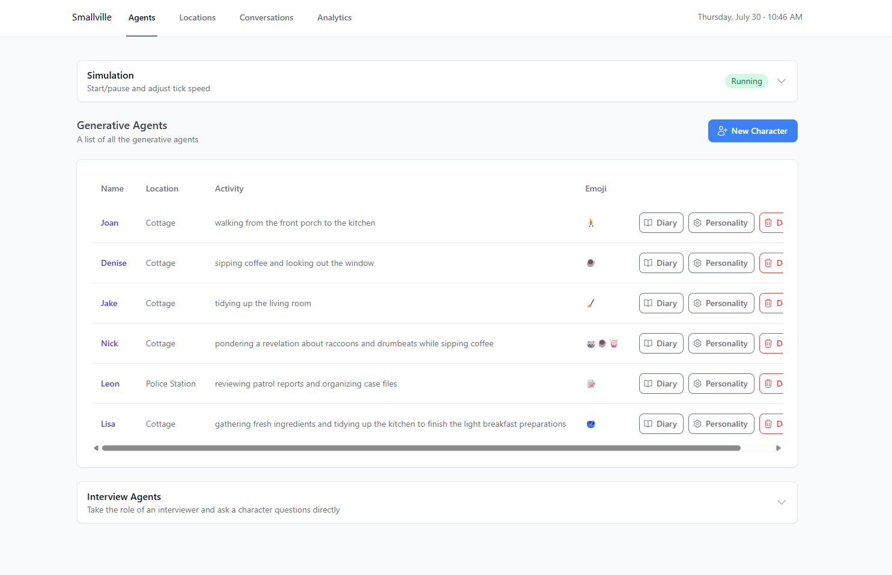
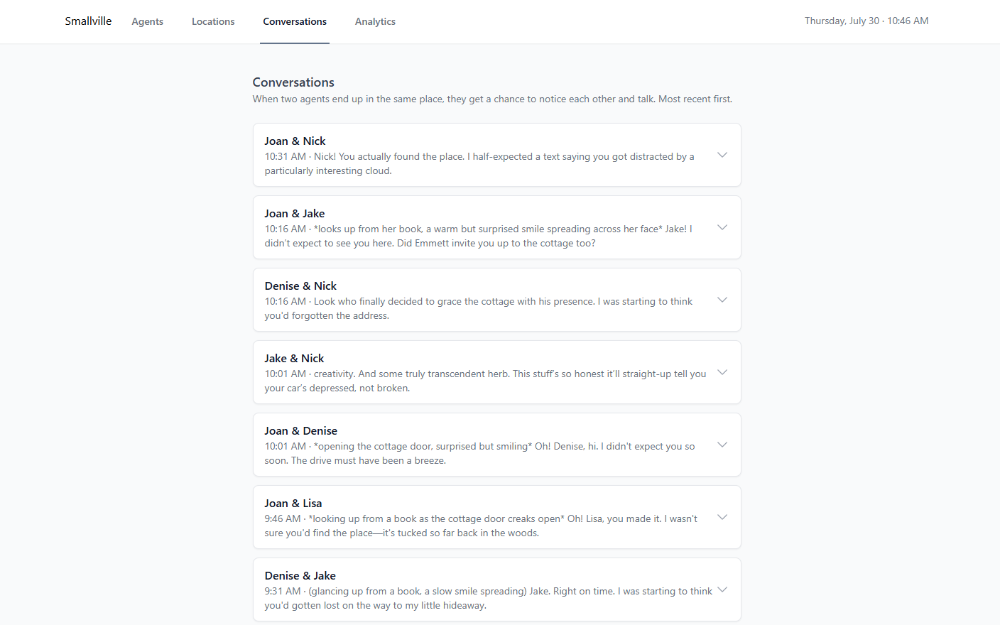

# Smallville [](LICENSE) [](https://github.com/nickm980/smallville) [](https://www.deepseek.com/)

## Generative agents for video games

Generative agents are virtual characters that store memories and dynamically react to their environment. Using an LLM, agents observe their surroundings, form and recall memories, make plans, and react to changes in the world around them — instead of following hand-written dialogue trees and schedules.

This is a fork of [nickm980/smallville](https://github.com/nickm980/smallville), a Java implementation of the technique from the paper [_Generative Agents: Interactive Simulacra of Human Behavior_](https://arxiv.org/pdf/2304.03442.pdf). This fork keeps the original simulation engine but changes the LLM backend and replaces the tooling around it with a full interactive dashboard, so you can actually watch and steer a town of agents instead of only driving them through the HTTP API.

## Screenshots

| Agents dashboard | Conversations |
| --- | --- |
|  |  |

## What's different in this fork

**Runs on DeepSeek, not OpenAI.** The server talks to any OpenAI-compatible chat completions endpoint — this fork points it at DeepSeek (`deepseek-v4-pro`) by default, which is cheaper and doesn't require an OpenAI key. Swapping to any other compatible provider (OpenAI, a local model server, etc.) is a two-line change in `config.yaml`.

**A real dashboard**, built with Next.js, replacing the old static/embedded UI:
- Create, edit, and delete agents and locations, including nested sub-locations (e.g. `Cottage: Kitchen`)
- **AI-generated personalities** — click a button when creating an agent and it invents a name plus a set of in-depth characteristics, checking for name collisions with existing agents
- **Play/pause and speed controls** — start or stop the simulation loop and adjust how many seconds of real time pass between ticks, decoupled from how much simulated time each tick advances (see [Ticks, intervals, and timesteps](#ticks-intervals-and-timesteps) below)
- **Per-agent diaries** — a chronological view of everything an agent has observed, planned, and reflected on
- **A global conversation feed** — grouped by conversation, paginated, with timestamps in simulated time
- A live simulated clock (with real weekday/date, not just a time-of-day) visible from every page

**Proximity-based conversations.** In the original engine, two agents only talk if you explicitly script it. This fork adds a lightweight system where agents who end up in the same location get a chance to notice each other and start a conversation on their own, with a cooldown so the same pair doesn't talk every single tick.

**A round of real bug fixes** found while building the above, all upstreamed into this fork:
- Chat requests were being encoded with the platform's default charset instead of UTF-8, corrupting non-ASCII output
- A crash when the model returned a compound location name (e.g. `"Cottage: Kitchen"`) that didn't exactly match a location
- A null-pointer crash when the model omitted an activity, plus per-agent fault isolation so one bad LLM response no longer kills the tick for every other agent
- Several new API endpoints (and two pre-existing ones) silently failed because the routing library needs a compiler flag to resolve `@Param`-annotated arguments, which isn't set — fixed by reading path params directly
- Agents could end up "talking to themselves" when an observation string happened to contain their own name
- A reaction-triggering loop that scaled O(n²) with agent count and could stall ticking for minutes with more than a handful of agents in one place
- Agents independently narrating schedules that contradicted each other (e.g. claiming to be having dinner with someone who was, according to the simulation's own ground truth, somewhere else) — the planning prompt now reconciles against the ground-truth state already available to it
- Memory/diary entries were sorted by their already-formatted `"h:mm a"` time string instead of the underlying timestamp, breaking ordering across the AM/PM boundary

## Ticks, intervals, and timesteps

Two independent settings control pacing:
- **Interval** — how many real-world seconds pass between ticks. Controlled from the dashboard's Simulation panel.
- **Timestep** — how many simulated minutes each tick advances the in-world clock (`POST /timestep`). Independent of the interval.

Running with a long interval (e.g. 180s) and a modest timestep (e.g. 15 minutes) is a good combination for a "start it, walk away, come back later" overnight run — enough ticks accumulate to produce an interesting story without burning through API calls too quickly.

## Getting started

**Prerequisites:** Java 17, [Maven](https://maven.apache.org/), Node 18+, and a [DeepSeek API key](https://platform.deepseek.com/) (or any other OpenAI-compatible API key, see [Configuration](#configuration)).

### 1. Build and run the server
```
cd smallville
mvn -DskipTests package
java -jar target/smallville-1.3.0-shaded.jar --api-key <YOUR_API_KEY> --port 8080
```
The server starts on port 8080 (override with `--port`).

### 2. Run the dashboard
```
cd dashboard
npm install
npm run dev
```
Open http://localhost:3000. The dashboard talks to the server on `localhost:8080` — no extra configuration needed.

### 3. Create your town
Use the dashboard to add locations and agents (or generate a personality with one click), then hit Start in the Simulation panel.

> **Note on persistence:** the server keeps all world state in memory only — there's currently no database backing it, so restarting the server loses agents, locations, and memory streams. If you need to survive a restart, save your agents'/locations' definitions somewhere yourself before stopping the server, and recreate them via the API afterward.

## Configuration

`smallville/src/main/resources/config.yaml` controls the LLM backend:
```yaml
apiPath: https://api.deepseek.com/chat/completions
model: deepseek-v4-pro
```
Point `apiPath` and `model` at any other OpenAI-compatible chat completions endpoint (OpenAI itself, a local model server, etc.) to use a different provider. `prompts.yaml` in the same directory controls the prompt templates sent for each part of the agent update pipeline (plans, reflections, current activity, and so on).

## Building your own game on top of it

The underlying engine is still a general-purpose simulation server reachable over HTTP, with Java and JavaScript client libraries if you'd rather drive it from your own game than use the dashboard.

Supported client languages: Java, JavaScript (or talk to the HTTP endpoints directly).

### Java
```xml
<repositories>
    <repository>
        <id>jitpack.io</id>
        <url>https://jitpack.io</url>
    </repository>
</repositories>
<dependencies>
    <dependency>
        <groupId>com.github.nickm980</groupId>
        <artifactId>smallville</artifactId>
        <version>2b663b0</version>
    </dependency>
</dependencies>
```
```java
SmallvilleClient client = SmallvilleClient.create("http://localhost:8080", new AgentHandlerCallback() {
    public void handle(SimulationUpdateEvent event) {
        List<SmallvilleAgent> agents = event.getAgents();
        List<SmallvilleLocation> locations = event.getLocations();
    }
});

client.createLocation("Red House");
client.createObject("Red House", "Kitchen", new ObjectState("occupied"));

List<String> memories = new ArrayList<String>();
memories.add("Memory1");
client.createAgent("John", memories, "Red House: Kitchen", "Cooking");

client.updateState();
```

### JavaScript
```
npm init
npm i smallville
```
```javascript
const client = new Smallville({
    host: "http://localhost:8080",
    stateHandler: function (state) {
        // update agent locations using your own pathfinding, etc.
        const agents = state.agents;
        const objects = state.locations;
        const conversations = state.conversations;

        console.log('[State Change]: The simulation has been updated');
    },
});
```
Asking an agent a question with `ask` does not create a new memory unless called with `addObservation`.

There's also a (rough, unfinished) [Phaser-based example](/examples/javascript-phaser) showing agents rendered in an actual 2D game world.

## Credits

- Forked from [nickm980/smallville](https://github.com/nickm980/smallville)
- Based on [_Generative Agents: Interactive Simulacra of Human Behavior_](https://arxiv.org/pdf/2304.03442.pdf)
- Tileset by LimeZu

## Getting help

For questions about the original engine and its community, see the upstream project's [Discord](https://discord.gg/APVSw2DrCX).

## License

MIT — see [LICENSE](LICENSE).
